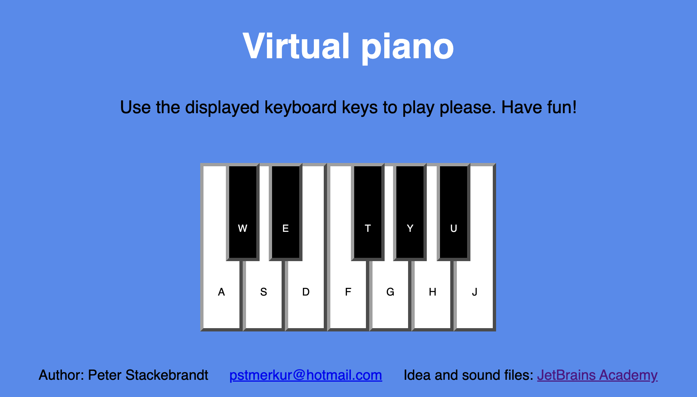
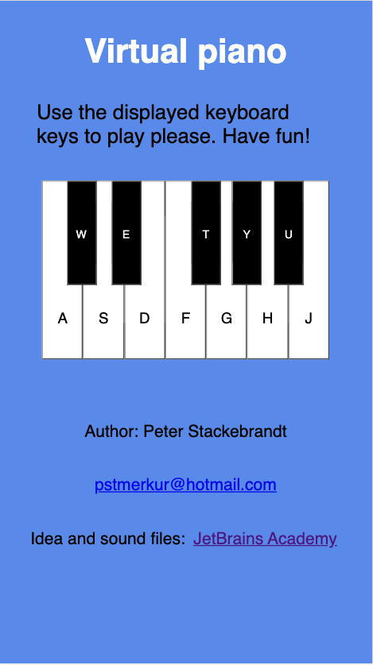

# Virtual piano
## Overview
HTML5 page, coded with HTML, CSS, JavaScript

This project bases on a training project by JetBrains Academy (JBA).
I created the Code. JBA provided the sound files and the main idea.
Project page: https://hyperskill.org/projects/101?track=5

## Main features
- The Page shows black and white piano keys.
- Each key contains a letter. 
- You can play piano sounds by using the corresponding keys on your computer keyboard.

### Screenshot

Desktop

iPhone 8

## Use/Installation

To get the project running on your local machine, you may:

### Copy and run my code only

- My code stays in "To-Do List/task/src".
- Run "todo_list/To-Do List/task/src/index.html" in Browser.

### Copy and run JetBrains full training project

- Copy training project
- Open it with JetBrains WebStorm.
- Run "virtual-piano/task/src/index.html" in Browser.

